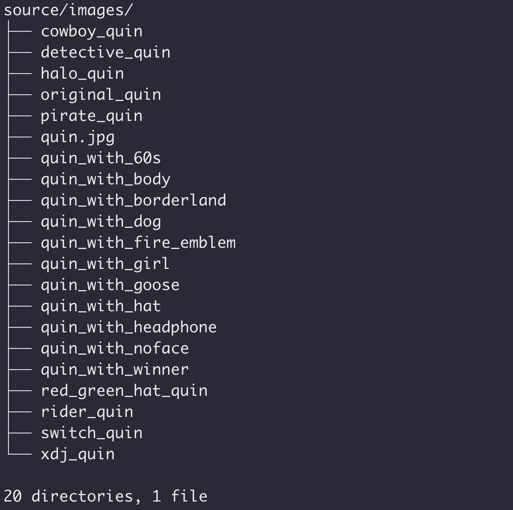

# Quin 皮肤表情收集


https://github.com/QuinProject/QuinCollection/

## 如何向本项目提交头像 or 分类？

1. 如果只是在已有分类里增加图片，只需要在 `source/images/<分类>` 的对应目录下放进图片提交即可。



例如现在有这样的分类，如果只想在网页里提交可以在 GitHub 网站内直接把文件拖入 + 使用 Commit 提交。


2. 如果需要增加一个表情包分类？

- 在 `source/images/` 下增加一个文件夹，建议英文名
- 在 `source/gallery/index.md` 文件内增加类似：

```

```

的路径，其中 `images/<xxxxx>` 表示我们上一步创建的路径，结尾的字符串代表展示时的分类名称

- 建议把最新的图添加在最前面